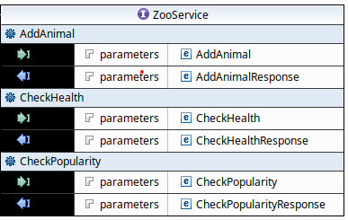
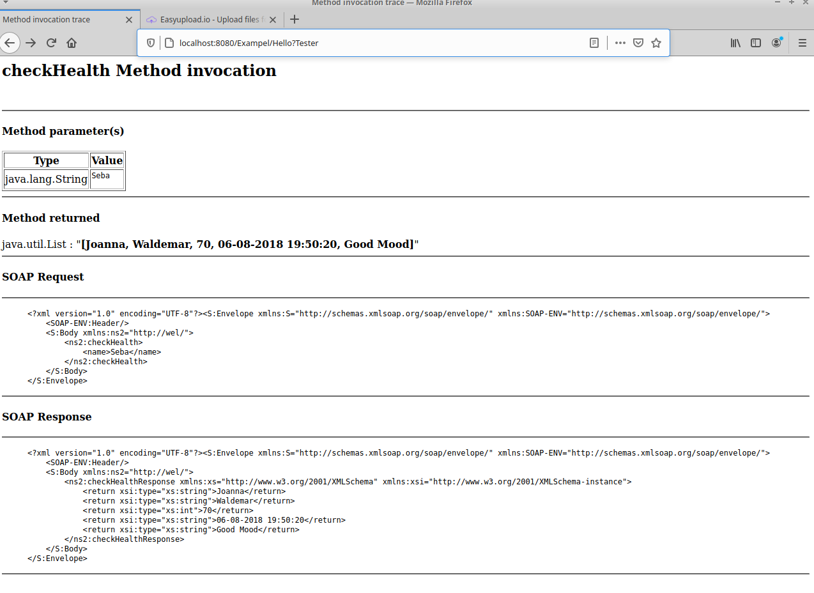
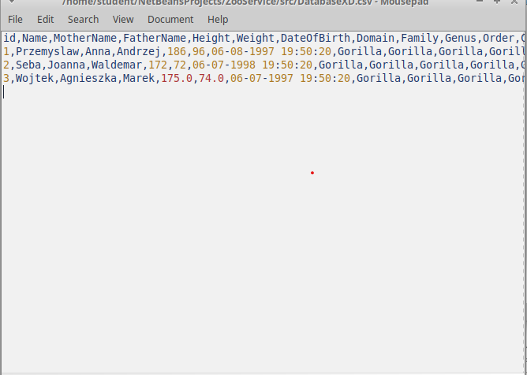
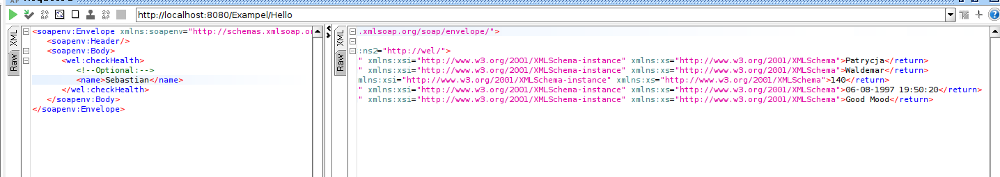

# Zoo Service
Project of Zoo Service (which helps in monitoring of health and popularity animals) created with use of SOA Architecture and SOAP Requests.

Architecture of our Service in the WSDL file (this screen shows us only operations) : 

Sample SOA request using default Tester (It doesn't allow us to use complex types): 

All the data is stored in "Database" for simplicity of this project it is only CSV file:

Complex types tests and overload tests can be done with use of SOAPUI:

